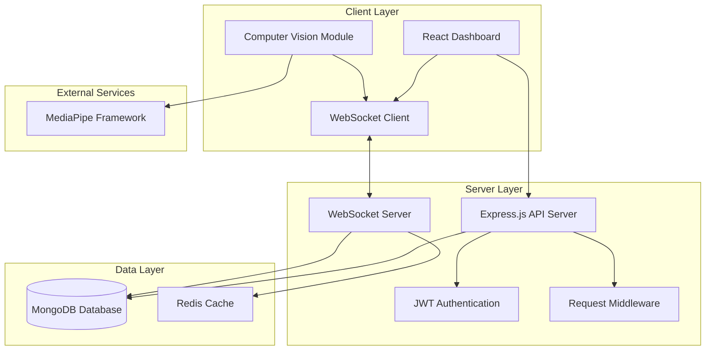

# Design Document

## Overview

ClassEngage is a real-time computer vision-powered educational monitoring application built as a full-stack web application. The system leverages MediaPipe for computer vision processing, React for the frontend dashboard, Node.js/Express for the backend API, and MongoDB for data persistence. The application operates in two distinct modes: Exam Mode for malpractice detection and Lecture Mode for engagement tracking.

The architecture follows a client-server model with real-time communication via WebSockets, enabling live data streaming from computer vision analysis to dashboard visualizations. The system emphasizes performance, scalability, and user experience while maintaining data privacy through individual teacher authentication.

## Architecture

### System Architecture



### Technology Stack

**Frontend:**
- React 18 with TypeScript for type safety and modern development
- Socket.io-client for real-time WebSocket communication
- Recharts for data visualization and live updating graphs
- MediaPipe Web for browser-based computer vision processing
- Tailwind CSS for responsive UI design

**Backend:**
- Node.js with Express.js framework for REST API
- Socket.io for WebSocket server implementation
- JWT (jsonwebtoken) for stateless authentication
- bcrypt for secure password hashing
- MongoDB with Mongoose ODM for data persistence
- Redis for session management and real-time data caching

**Computer Vision:**
- MediaPipe Face Landmarker for face detection and landmark tracking
- MediaPipe Pose for head pose estimation
- Browser WebRTC API for camera access and video streaming

## Components and Interfaces

### Frontend Components

#### Dashboard Component
- **Purpose**: Main container for teacher interface and mode selection
- **Props**: `user: User, currentMode: 'exam' | 'lecture'`
- **State**: Current operational mode, real-time metrics, connection status
- **Methods**: `switchMode()`, `exportData()`, `logout()`

#### ExamModeComponent
- **Purpose**: Displays exam monitoring interface with malpractice tracking
- **Props**: `sessionId: string, students: Student[]`
- **State**: Warning counts, malpractice events, active violations
- **Methods**: `issueWarning()`, `markMalpractice()`, `resetSession()`

#### LectureModeComponent
- **Purpose**: Shows real-time engagement metrics and visualizations
- **Props**: `sessionId: string, engagementData: EngagementMetrics`
- **State**: Live engagement score, person count, behavioral counters
- **Methods**: `updateMetrics()`, `calculateEngagementScore()`

#### ComputerVisionProcessor
- **Purpose**: Handles MediaPipe integration and real-time analysis
- **Props**: `mode: 'exam' | 'lecture', onDataUpdate: Function`
- **State**: Camera stream, detection results, processing status
- **Methods**: `initializeCamera()`, `processFrame()`, `detectFaces()`, `analyzeBehavior()`

#### RealTimeChart
- **Purpose**: Displays live updating charts and graphs
- **Props**: `data: ChartData[], type: 'line' | 'pie' | 'bar'`
- **State**: Chart data buffer, update frequency, animation state
- **Methods**: `updateChart()`, `exportChartData()`

### Backend Components

#### AuthenticationController
- **Purpose**: Handles user login, registration, and JWT token management
- **Methods**: `login()`, `register()`, `verifyToken()`, `refreshToken()`
- **Dependencies**: bcrypt, jsonwebtoken, User model

#### SessionController
- **Purpose**: Manages classroom sessions and mode switching
- **Methods**: `createSession()`, `updateSession()`, `getSessionHistory()`
- **Dependencies**: Session model, WebSocket server

#### DataController
- **Purpose**: Handles data persistence and retrieval operations
- **Methods**: `saveEngagementData()`, `exportToCSV()`, `getAnalytics()`
- **Dependencies**: MongoDB models, CSV generation library

#### WebSocketHandler
- **Purpose**: Manages real-time communication between client and server
- **Methods**: `handleConnection()`, `broadcastData()`, `handleDisconnection()`
- **Dependencies**: Socket.io, Redis for scaling

### API Interfaces

#### Authentication Endpoints
```typescript
POST /api/auth/login
  Body: { email: string, password: string }
  Response: { token: string, user: User, expiresIn: number }

POST /api/auth/register
  Body: { email: string, password: string, name: string }
  Response: { message: string, user: User }

GET /api/auth/verify
  Headers: { Authorization: "Bearer <token>" }
  Response: { valid: boolean, user: User }
```

#### Session Management Endpoints
```typescript
POST /api/sessions
  Body: { mode: 'exam' | 'lecture', className: string }
  Response: { sessionId: string, startTime: Date }

GET /api/sessions/:teacherId
  Response: { sessions: Session[], totalCount: number }

PUT /api/sessions/:sessionId
  Body: { engagementData: EngagementMetrics | MalpracticeEvent }
  Response: { success: boolean, updatedAt: Date }
```

#### Data Export Endpoints
```typescript
GET /api/export/csv/:sessionId
  Response: CSV file download with engagement/malpractice data

GET /api/analytics/:teacherId
  Query: { startDate?: Date, endDate?: Date, mode?: string }
  Response: { averageEngagement: number, sessionCount: number, trends: ChartData[] }
```

### WebSocket Events

#### Client to Server Events
```typescript
'join-session': { sessionId: string, teacherId: string }
'cv-data': { 
  faces: FaceData[], 
  engagement: EngagementMetrics, 
  violations?: MalpracticeEvent[] 
}
'mode-switch': { newMode: 'exam' | 'lecture', sessionId: string }
```

#### Server to Client Events
```typescript
'session-joined': { sessionId: string, currentData: SessionData }
'real-time-update': { 
  timestamp: Date, 
  data: EngagementMetrics | MalpracticeEvent 
}
'mode-switched': { mode: 'exam' | 'lecture', sessionId: string }
'error': { message: string, code: number }
```

## Data Models

### User Model (MongoDB)
```typescript
interface User {
  _id: ObjectId;
  email: string;           // Unique identifier for login
  password: string;        // bcrypt hashed password
  name: string;           // Display name for teacher
  createdAt: Date;
  updatedAt: Date;
  lastLogin?: Date;
}
```

### Session Model (MongoDB)
```typescript
interface Session {
  _id: ObjectId;
  teacherId: ObjectId;     // Reference to User
  mode: 'exam' | 'lecture';
  className: string;
  startTime: Date;
  endTime?: Date;
  isActive: boolean;
  metadata: {
    totalStudents?: number;
    averageEngagement?: number;
    totalViolations?: number;
  };
}
```

### EngagementData Model (MongoDB)
```typescript
interface EngagementData {
  _id: ObjectId;
  sessionId: ObjectId;     // Reference to Session
  timestamp: Date;
  personCount: number;
  engagementScore: number; // 0-100 calculated score
  metrics: {
    eyesClosedCount: number;
    eyesClosedDuration: number;    // milliseconds
    headPoseDirections: {
      forward: number;
      left: number;
      right: number;
      up: number;
      down: number;
    };
    gazeDirections: {
      center: number;
      left: number;
      right: number;
      up: number;
      down: number;
    };
  };
  faceData: FaceDetection[];
}
```

### MalpracticeEvent Model (MongoDB)
```typescript
interface MalpracticeEvent {
  _id: ObjectId;
  sessionId: ObjectId;     // Reference to Session
  studentId: string;       // Identifier for student (face ID or position)
  timestamp: Date;
  eventType: 'suspicious_movement' | 'looking_away' | 'multiple_faces' | 'no_face_detected';
  severity: 'low' | 'medium' | 'high';
  warningCount: number;    // Current warning count for this student
  isMalpractice: boolean;  // True if exceeded 5 warnings
  description: string;
  confidence: number;      // 0-1 confidence score from CV analysis
}
```

### FaceDetection Model (Embedded)
```typescript
interface FaceDetection {
  faceId: string;          // Unique identifier for tracking
  boundingBox: {
    x: number;
    y: number;
    width: number;
    height: number;
  };
  landmarks: {
    leftEye: Point3D;
    rightEye: Point3D;
    nose: Point3D;
    mouth: Point3D;
  };
  headPose: {
    pitch: number;         // Head up/down rotation
    yaw: number;           // Head left/right rotation
    roll: number;          // Head tilt rotation
  };
  eyeState: {
    leftEyeOpen: boolean;
    rightEyeOpen: boolean;
    eyesClosedDuration: number;
  };
  gazeDirection: {
    x: number;             // Normalized gaze vector
    y: number;
    z: number;
  };
  isOccluded: boolean;
  confidence: number;
}
```

### Point3D Model (Embedded)
```typescript
interface Point3D {
  x: number;
  y: number;
  z: number;
}
```

## Correctness Properties

*A property is a characteristic or behavior that should hold true across all valid executions of a system—essentially, a formal statement about what the system should do. Properties serve as the bridge between human-readable specifications and machine-verifiable correctness guarantees.*

### Property 1: Mode Management Consistency
*For any* ClassEngage system instance, the system should provide exactly two operational modes (Exam_Mode and Lecture_Mode), and when a teacher selects a mode, the corresponding monitoring capabilities should be activated while preserving existing session data and displaying the current mode clearly in the UI.
**Validates: Requirements 1.1, 1.2, 1.3, 1.4**

### Property 2: Authentication Security
*For any* authentication attempt, valid credentials should grant access to the teacher's dashboard, invalid credentials should deny access with appropriate error messages, and logout should terminate the session requiring re-authentication.
**Validates: Requirements 2.1, 2.2, 2.4**

### Property 3: Data Isolation and Privacy
*For any* teacher in the system, their data should be stored separately from other teachers' data, they should only be able to access their own data and analytics, and unauthorized access to other teachers' data should be prevented.
**Validates: Requirements 2.3, 2.5, 8.4**

### Property 4: Computer Vision Analysis
*For any* video stream input, the computer vision engine should detect and track human faces in real-time, analyze head pose and gaze direction when faces are detected, detect eye closure with duration measurement, exclude occluded people from counts, and provide real-time analysis results to the monitoring system.
**Validates: Requirements 3.1, 3.2, 3.3, 3.4, 3.5**

### Property 5: Malpractice Detection and Warning System
*For any* exam session, suspicious behaviors should be detected and classified as malpractice events, warnings should be issued for each event, students should be marked as having committed malpractice after receiving their 5th warning, warning counts should be maintained per student, and all events should be logged with timestamps.
**Validates: Requirements 4.1, 4.2, 4.3, 4.4, 4.5**

### Property 6: Engagement Tracking in Lecture Mode
*For any* lecture session, the system should calculate and display real-time engagement scores, track eyes closed duration with running counters, monitor head pose directions with directional counters, track gaze directions with pattern counters, count visible people in camera feed, and update counts when people become occluded.
**Validates: Requirements 5.1, 5.2, 5.3, 5.4, 5.5, 5.6**

### Property 7: Real-time Dashboard Updates
*For any* dashboard instance, real-time engagement metrics should be displayed with live updating visualizations, graphs and charts should update automatically when new data is available without page refresh, current person count and engagement statistics should be shown in real-time, and exam mode should display warning counts and malpractice status.
**Validates: Requirements 6.1, 6.2, 6.3, 6.4**

### Property 8: Data Export Functionality
*For any* engagement data in the system, it should be exportable to CSV format with timestamps, engagement scores, and behavioral metrics included in the export.
**Validates: Requirements 7.1, 7.2**

### Property 9: Historical Data and Analytics
*For any* teacher's data, the dashboard should display historical data analysis with trend visualizations, show pie charts representing average engagement across all classes, and maintain class records with historical session data.
**Validates: Requirements 7.3, 7.4, 7.5**

### Property 10: Data Persistence and Retrieval
*For any* system operation, all engagement data, malpractice events, and session information should be persisted to the database, historical class data should be retrieved and displayed when teachers log in, and data updates should be immediately persisted to prevent data loss.
**Validates: Requirements 8.1, 8.2, 8.5**

### Property 11: Responsive Interface Design
*For any* screen size or device, the web interface should remain responsive and functional, and user interactions should provide clear visual feedback with user-friendly error messages and system notifications.
**Validates: Requirements 9.1, 9.4, 9.5**

## Error Handling

### Computer Vision Error Handling
- **Camera Access Failures**: Gracefully handle camera permission denials or hardware unavailability with clear user messaging and fallback options
- **MediaPipe Processing Errors**: Implement retry mechanisms for temporary processing failures and fallback to basic detection when advanced features fail
- **Face Detection Failures**: Continue operation when no faces are detected, log detection confidence levels, and provide feedback about detection quality

### Authentication and Session Errors
- **Invalid Credentials**: Return standardized error responses without revealing whether email or password is incorrect (security best practice)
- **Token Expiration**: Implement automatic token refresh where possible, graceful logout when refresh fails, and clear messaging about session expiration
- **Database Connection Failures**: Implement connection pooling, retry logic for transient failures, and offline mode capabilities where feasible

### Real-time Communication Errors
- **WebSocket Connection Failures**: Implement automatic reconnection with exponential backoff, queue data during disconnections, and provide connection status indicators
- **Data Transmission Errors**: Validate data integrity, implement message acknowledgments, and handle partial data transmission gracefully
- **Server Overload**: Implement rate limiting, queue management, and graceful degradation of real-time features when under load

### Data Persistence Errors
- **Database Write Failures**: Implement transaction rollbacks, data validation before persistence, and retry mechanisms for transient failures
- **Export Generation Errors**: Validate data completeness before export, handle large dataset exports with streaming, and provide progress indicators for long operations
- **Data Corruption**: Implement data validation, backup strategies, and recovery procedures for corrupted data scenarios

## Testing Strategy

### Dual Testing Approach

The ClassEngage application will employ both unit testing and property-based testing to ensure comprehensive coverage and correctness validation.

**Unit Tests** will focus on:
- Specific examples of computer vision detection scenarios
- Authentication edge cases (expired tokens, malformed requests)
- Database operation error conditions
- UI component rendering with specific data sets
- Integration points between frontend and backend components
- CSV export format validation with known datasets

**Property-Based Tests** will focus on:
- Universal properties that hold across all valid inputs
- Computer vision analysis consistency across different video inputs
- Authentication security across various credential combinations
- Data persistence integrity across different session types
- Real-time communication reliability across network conditions

### Property-Based Testing Configuration

**Testing Framework**: Fast-check for JavaScript/TypeScript property-based testing
**Minimum Iterations**: 100 iterations per property test to ensure comprehensive input coverage
**Test Tagging**: Each property test will be tagged with a comment referencing its design document property

**Tag Format**: `// Feature: class-engage, Property {number}: {property_text}`

**Example Property Test Structure**:
```typescript
// Feature: class-engage, Property 1: Mode Management Consistency
test('system provides exactly two modes and activates correct capabilities', () => {
  fc.assert(fc.property(
    fc.record({
      selectedMode: fc.constantFrom('exam', 'lecture'),
      sessionData: fc.object(),
      teacherId: fc.string()
    }),
    (input) => {
      // Test implementation
      const system = new ClassEngageSystem();
      const availableModes = system.getAvailableModes();
      expect(availableModes).toHaveLength(2);
      expect(availableModes).toContain('exam');
      expect(availableModes).toContain('lecture');
      
      system.selectMode(input.selectedMode, input.sessionData);
      expect(system.getCurrentMode()).toBe(input.selectedMode);
      expect(system.getSessionData()).toEqual(input.sessionData);
    }
  ));
});
```

### Testing Implementation Requirements

1. **Each correctness property MUST be implemented by a SINGLE property-based test**
2. **Property tests MUST run a minimum of 100 iterations** due to randomization requirements
3. **Unit tests and property tests are complementary** - both are required for comprehensive coverage
4. **Property tests MUST reference their corresponding design document property** using the specified tag format
5. **Test failures MUST provide clear diagnostic information** including input values that caused the failure

### Performance Testing Considerations

While not part of the core correctness properties, performance testing should be conducted for:
- Real-time computer vision processing latency (target: <100ms per frame)
- WebSocket message delivery times (target: <50ms end-to-end)
- Dashboard update responsiveness (target: <16ms for 60fps updates)
- Database query performance under load (target: <200ms for complex queries)
- CSV export generation time for large datasets (target: <30 seconds for 10,000 records)

These performance requirements will be validated through separate load testing and benchmarking procedures outside the property-based testing framework.